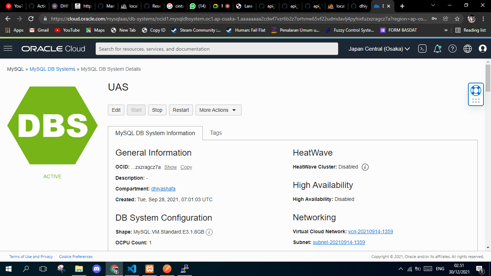

# Platform As A Service (PaaS)

##  Langkah=langkah Pengerjaan PaaS
### Langkah 1

 

### Langkah 2
 

### Langkah 3
 

### Langkah 4
 

### Langkah 5
 

### Langkah 6
 

 ### Langkah 7
 

 ### Langkah 8
 

 ### Langkah 9
 

 ### Langkah 10
 

  ### Langkah 11
 

  ### Langkah 12
 