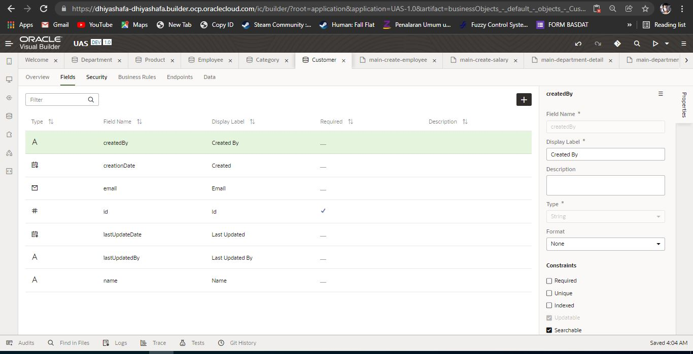
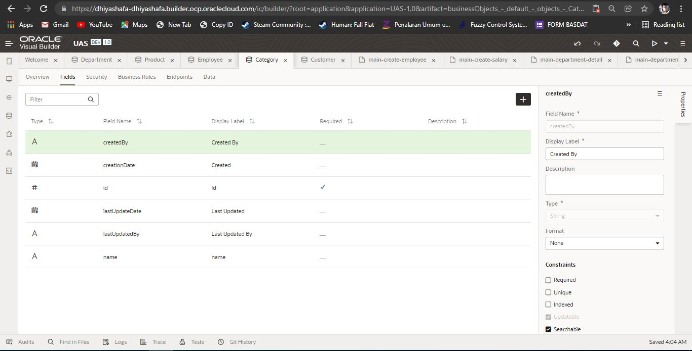
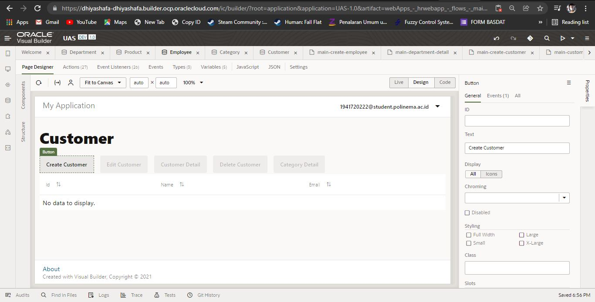
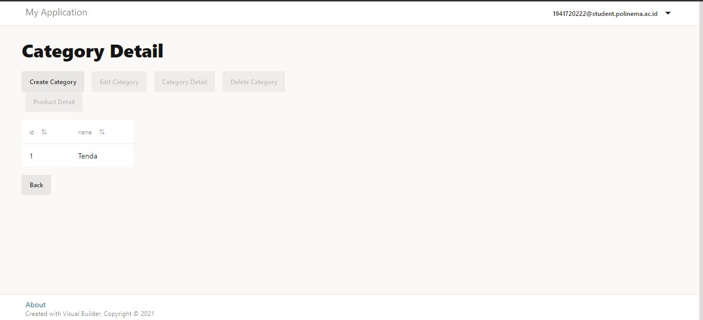
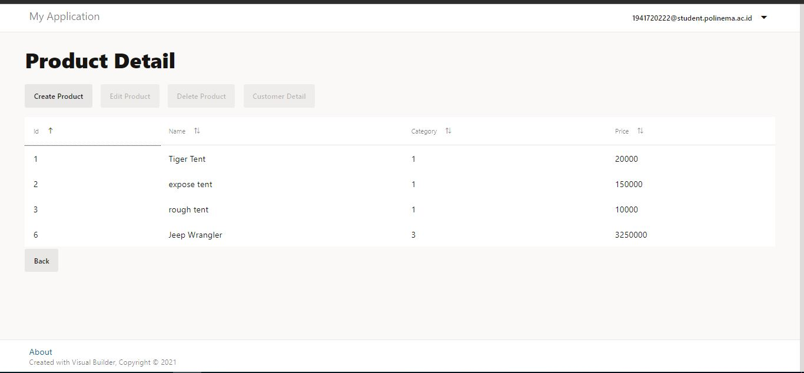
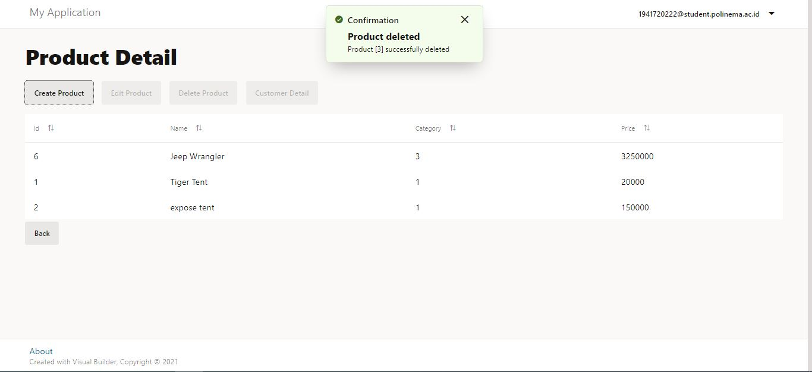

# 08 - Software as a Service

## Tujuan Pembelajaran

1. Mengetahui layanan Oracle Cloud Infrasturcture Software as a Service.
2. Mampu mengguankan layanan software layanan oracle.

##  Langkah-Langkah Praktikum
### **Membuat instance untuk visual builder**
 
 
 
 
 

### **Membuat awal aplikasi**
 
 
 
 
 
 
 

  ### **Membuat business object**
 
 
 
 
 
 
 
 
 
 
 
 
 
 
 
 
 
 

   ### **Membuat tabel dan create pada department**
 
 
 
 
 
 
 
 
 
 
 
 
 
 

   ### **Membuat tabel dan create pada employees**
 
 
 
 
 
 
 
 
 
 
 
 

   ### **Rename main dan mengecek code**
 
 
 

   ### **Mengecek jalannya create page**
 
 
 

  ### **Membuat display page, navigasi, dan import data ke tabel pada employees**
 
 
 
 
 
 

  ### **Membuat display page, navigasi, edit page, detail page, delete page pada department**
 
 
 
 
 
 
 
 
 

  ### **Membuat edit page, detail page, delete page pada employees. juga mengedit layout form**
 
 
 
 
 
 
 
 
 

  ### **Melakukan stage pada aplikasi**
 
 
 

  ### **Melakukan publish pada aplikasi dan membuatnya live**
 
 
 

 Catat link dari aplikasi yang telah kita buat, dari link tersebut kita membagikannya ke Public User:
 https://dhiyashafa-dhiyashafa.builder.ocp.oraclecloud.com/ic/builder/rt/Dhiyashafa_SaaS/live/webApps/hrwebapp/

  ### **Import data dan stage**
 
 
 
 
 
 

 ## Hasil Tugas : Software as s Service (SaaS)

1. Buatlah laporan dan dokumentasi dari praktikum yang Anda lakukan. 

2. Tambahkan business object Salary 

      
      
      
      
      
      
      
     
   
3. Buat main page dari salary dan buat action create, edit, detail dan Delete.
 
      
      
      
      
      
      
      
      
      
      
      
      
      
      
      
      
      
      
      
  