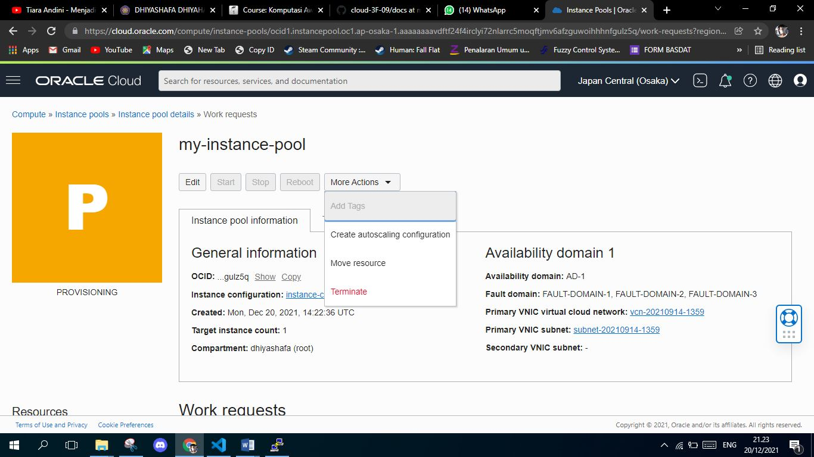
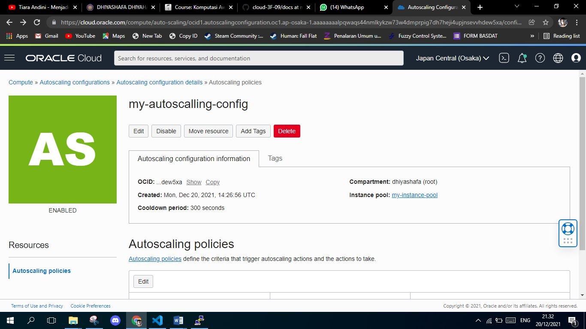

# Autoscalling

##  Langkah-Langkah Pengerjaan
### Langkah 1

 

### Langkah 2
 

### Langkah 3
 

### Langkah 4
 

### Langkah 5
 

### Langkah 6
 

 ### Langkah 7
 

 ### Langkah 8
 

 ### Langkah 9
 

 ### Langkah 10
 

  ### Langkah 11
 

  ### Langkah 12
 

   ### Langkah 13
 

 